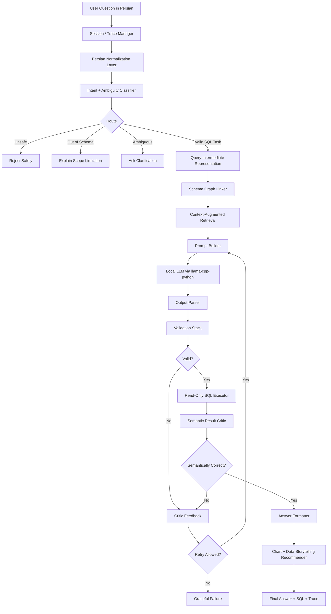

# 01 - Research-Grade Architecture

**Status:** Updated architecture source aligned with v2.3 execution-ready proposal  
**Version:** v2.3 Execution-Ready alignment  
**Updated focus:** implementation-first, reliability-first, edge-aware, benchmark-auditable.


## 1. Project Vision

VTD-Edge should be designed as a **research-grade Persian Text-to-SQL framework**, not merely an app that turns questions into SQL. The final system should be accurate, measurable, explainable, reproducible, and publishable.

The ideal architecture has three goals:

1. **Accuracy:** Reduce hallucinated tables, wrong columns, invalid joins, wrong aggregation, and unsafe SQL.
2. **Reliability:** Use deterministic validation, stateful retry, and error-aware correction.
3. **Research Value:** Produce benchmark results, ablation studies, error taxonomies, and reproducible artifacts.

---

## 2. Architecture Name

Recommended architecture name:

> **PARS-SQL: Persian-Aware Reflexive Schema-grounded Text-to-SQL**

Optional expansion:

```text
P = Persian-aware normalization and semantic mapping
A = Augmented retrieval with schema, examples, and SQL skeletons
R = Reflexive validation and repair
S = Schema-grounded SQL generation
```

---

## 3. High-Level System Diagram



---

## 4. Layered Architecture

### Layer 0: Session, Trace, and Experiment Manager

**Purpose:** Make every query reproducible and analyzable.

Responsibilities:

- Assign `trace_id` to every query.
- Store all states, prompts, SQL attempts, validation errors, and execution results.
- Attach configuration metadata: model name, embedding model, RAG top-k, temperature, max retries.
- Persist benchmark traces for research.

Output example:

```json
{
  "trace_id": "2026-05-10T13-44-21_q_00017",
  "config_id": "full_pipeline_qwen25coder7b_rag5_reflexion3",
  "model": "Qwen2.5-Coder-7B-Instruct-Q4_K_M",
  "embedding_model": "intfloat/multilingual-e5-small",
  "started_at": "2026-05-10T13:44:21"
}
```

---

### Layer 1: Persian Input Understanding

This layer cleans the user question and extracts basic linguistic signals.

Subcomponents:

1. `PersianNormalizer`
2. `PersianNumberNormalizer`
3. `PersianDateNormalizer`
4. `ColloquialMapper`
5. `DomainTermMapper`
6. `PIIGuard` if real sensitive data is used

Output:

```json
{
  "raw_question": "میانگین افسردگی دانشجوها تو ترم قبل چقدر بوده؟",
  "normalized_question": "میانگین افسردگی دانشجوها در ترم قبل چقدر بوده؟",
  "normalized_tokens": ["میانگین", "افسردگی", "دانشجو", "ترم", "قبل"],
  "detected_terms": ["depression", "student", "average", "previous_semester"]
}
```

---

### Layer 2: Intent, Ambiguity, and Safety Routing

Before schema linking or SQL generation, the system must decide whether SQL should be generated at all.

Intent taxonomy:

| Intent | Description | SQL? |
|---|---|---|
| `count_query` | count records/entities | Yes |
| `aggregation_query` | AVG, SUM, MIN, MAX | Yes |
| `grouping_query` | grouped aggregation | Yes |
| `ranking_query` | top/bottom N | Yes |
| `trend_query` | time-based trend | Yes |
| `raw_retrieval_query` | list rows | Yes, with LIMIT |
| `comparison_query` | compare groups/time periods | Yes |
| `definition_query` | asks meaning of a field | Maybe no SQL |
| `chart_query` | asks for visualization | SQL + chart metadata |
| `ambiguous_query` | under-specified metric or filter | No, ask clarification |
| `out_of_schema_query` | asks unavailable concept | No |
| `unsafe_query` | delete/update/modify/leak | No |

---

### Layer 3: Query Intermediate Representation (QIR)

This is the main improvement over a simple RAG pipeline.

Instead of asking the LLM to jump directly from Persian to SQL, create a structured intermediate plan first.

```json
{
  "task_type": "grouped_aggregation",
  "metric": {
    "name": "depression_score",
    "candidate_columns": ["clinical_assessments.phq9_score"]
  },
  "aggregation": "AVG",
  "dimensions": ["individuals_core.gender"],
  "filters": [
    {
      "semantic": "student only",
      "resolved_as": "INNER JOIN student_metrics ON user_id"
    }
  ],
  "time_range": null,
  "needs_join": true,
  "expected_result_shape": "table",
  "chart_intent": false
}
```

Benefits:

1. Makes semantic errors easier to detect.
2. Makes schema linking measurable.
3. Reduces prompt ambiguity.
4. Enables ablation: direct SQL vs QIR → SQL.

---

### Layer 4: Schema Graph Linking

The schema is represented as a graph, not just a text block.

Nodes:

- Tables
- Columns
- Foreign keys
- Business concepts
- Persian aliases
- SQL skeleton templates

Edges:

- `table_has_column`
- `column_alias`
- `table_joinable_to_table`
- `concept_maps_to_column`
- `metric_uses_column`

Example:

```text
"افسردگی" → concept: depression → clinical_assessments.phq9_score
"دانشجو" → entity: student → student_metrics.user_id
student_metrics.user_id → FK → individuals_core.user_id
```

Recommended implementation:

```text
networkx graph
+ JSON schema snapshot
+ alias dictionary
+ RapidFuzz matching
+ embedding fallback for semantic aliases
```

---

### Layer 5: Context-Augmented Generation (CAG)

The prompt should be augmented from multiple controlled sources:

1. **Schema context:** only relevant DDL and join paths.
2. **Business glossary:** Persian term → schema mapping.
3. **Golden examples:** retrieved by hybrid scoring.
4. **SQL skeletons:** retrieved by intent and query structure.
5. **Validation constraints:** allowed dialect, forbidden operations, output format.
6. **Prior failed attempts:** only inside repair loops.

Do not inject the entire schema unless the schema is tiny. For larger schemas, this harms local models.

---

### Layer 6: SQL Candidate Generation

The LLM generates a candidate SQL query and metadata.

Recommended output format:

```json
{
  "sql": "SELECT AVG(ca.phq9_score) AS avg_depression FROM clinical_assessments ca JOIN student_metrics sm ON sm.user_id = ca.user_id;",
  "confidence": 0.82,
  "assumptions": ["Student means rows present in student_metrics"],
  "used_columns": ["clinical_assessments.phq9_score", "student_metrics.user_id"],
  "result_shape": "single_value"
}
```

Do not accept raw markdown code blocks as the only contract. Parse structured JSON when possible.

---

### Layer 7: Validation Stack

Validation must be deterministic first, LLM-assisted second.

Checks:

1. Single statement check
2. Read-only `SELECT` check
3. Forbidden keyword check
4. SQL parse check with `sqlglot`
5. Table existence check
6. Column existence check
7. Join path check
8. Aggregation/group-by check
9. Type compatibility check
10. Raw retrieval limit check
11. QIR-vs-SQL semantic alignment check
12. Execution dry-run or limited execution

---

### Layer 8: Reflexion, SQL Surgeon, and Semantic Critic

The repair system has three roles:

| Role | Responsibility |
|---|---|
| `Critic` | detect and explain error |
| `Surgeon` | deterministic repair for common errors |
| `Generator` | regenerate only when deterministic repair is not safe |

Recommended order:

```text
Validate → Try deterministic repair → Revalidate → If still invalid, send structured critic feedback to LLM
```

This is more reliable than always asking the LLM to fix itself.

---

### Layer 9: Safe Execution and Result Validation

Execution must be read-only.

Execution rules:

- SQLite read-only URI.
- Short timeout.
- `LIMIT` for raw row retrieval.
- No multiple statements.
- No side effects.
- Store result hash for benchmark comparison.

Result validation:

- Empty result sanity.
- Unexpectedly huge result warning.
- Expected shape check.
- Metric type check.
- Group count sanity.

---

### Layer 10: Answer, XAI, and Chart Recommendation

The final answer should include:

1. Natural Persian explanation.
2. SQL used, optionally hidden in UI but logged.
3. Result table or KPI.
4. Chart recommendation if appropriate.
5. Confidence and assumptions.
6. Trace ID for debugging.

Example:

```json
{
  "answer_fa": "میانگین نمره افسردگی دانشجویان ۱۲.۴ است.",
  "sql": "SELECT AVG(ca.phq9_score) ...",
  "chart": {
    "type": "kpi_card",
    "reason": "The result is a single aggregated value."
  },
  "trace_id": "..."
}
```

---

## 5. Why This Architecture Is Stronger Than the Previous One

The earlier design already had normalization, RAG, schema linking, generation, and reflexion. The upgraded research-grade version adds:

1. **Query Intermediate Representation** for measurable semantic planning.
2. **Schema graph linking** instead of flat alias matching.
3. **Tri-channel CAG**: schema + examples + SQL skeletons.
4. **SQL Surgeon** for deterministic auto-repair.
5. **Anti-loop Reflexion memory** to prevent repeated bad attempts.
6. **Formal error taxonomy** for publishable analysis.
7. **Ablation-first implementation** for scientific credibility.

---

## 6. Minimal Viable Research System

The minimum publishable version should include:

1. 500-query bilingual benchmark.
2. Persian normalization module with tests.
3. Schema linker with accuracy report.
4. Hybrid retrieval with top-k recall report.
5. Local LLM baseline.
6. RAG-only variant.
7. Full reflexive variant.
8. Execution accuracy and exact match metrics.
9. Error taxonomy.
10. Reproducible GitHub repository.


---

## 7. v2.3 Execution-Ready Architecture Updates

### 7.1 Two Runtime Modes

PARS-SQL has two runtime targets:

| Runtime | Purpose | Implementation |
|---|---|---|
| Research Runtime | benchmarking, ablation, tracing, paper experiments | LangGraph + full trace manager |
| Edge Runtime | clinic laptop, tablet, mobile, future smartwatch-style deployment | lightweight deterministic state machine after research pipeline stabilizes |

LangGraph is the right choice for research because it supports routing, retry, checkpointing, and traceability. It should not automatically be assumed to be the final mobile/edge runtime because its orchestration overhead may be unnecessary on constrained devices.

### 7.2 Value Retrieval as a Core Layer

Schema linking maps question terms to tables and columns. Value retrieval maps user-facing values to actual database values.

Examples:

```text
"زن"      -> individuals_core.gender = 'Female'
"مرد"     -> individuals_core.gender = 'Male'
"افسرده"  -> depression_flag = 1 or phq9_score rule, depending on table
"فروردین ۱۴۰۴" -> explicit Gregorian date range if a date column exists
```

Value retrieval must run before SQL generation. Without it, the model may produce syntactically valid but semantically wrong filters.

### 7.3 Reliability Gate and Abstention

The architecture is reliability-first, not accuracy-only. The system may return one of three final states:

```text
ANSWER_WITH_SQL
ASK_CLARIFICATION
ABSTAIN_OR_WARN
```

Abstention is required when:

1. schema confidence is low,
2. query is ambiguous,
3. SQL candidates are inconsistent,
4. semantic critic rejects the result,
5. the request is unsafe or out of schema.

### 7.4 Consistency-Based Candidate Selection

When enabled, the generator may produce multiple SQL candidates. The system compares:

- selected tables,
- selected columns,
- join paths,
- aggregation shape,
- execution result shape,
- result equivalence when safe to execute.

If candidates disagree beyond a configured threshold, the system should abstain or ask clarification rather than choose a random candidate.

### 7.5 Feature Decision Rule

Before implementing any new component, classify it as one of:

```text
MVP_NOW
PAPER_1
PAPER_2
EDGE_LATER
DO_NOT_BUILD_YET
```

This prevents the system from becoming too large before the first benchmark result exists.
