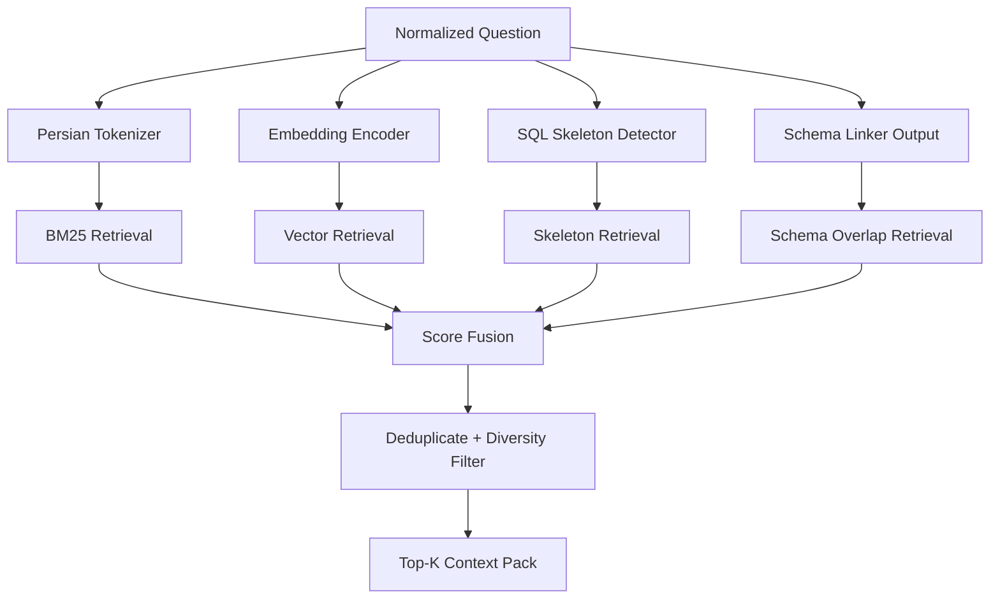

# 04 - RAG, CAG, and Retrieval Design

**Status:** Updated with v2.3 value retrieval, adaptive context compression, and modular retrieval evaluation  
**Version:** v2.3 Execution-Ready alignment  
**Updated focus:** implementation-first, reliability-first, edge-aware, benchmark-auditable.


## 1. Purpose

The goal of retrieval is not to “add documents to the prompt”. The goal is to provide the LLM with the **minimum high-value context** needed to produce correct SQL.

This architecture uses **CAG: Context-Augmented Generation** with three context channels:

1. Schema context
2. Golden SQL examples
3. SQL skeleton templates

---

## 2. Context Channels

### 2.1 Schema Context

Generated by the schema linker.

Contains:

- Relevant table DDL
- Relevant columns
- Join paths
- Column descriptions
- Business rules
- Anti-hallucination notes

Example:

```text
TABLE clinical_assessments
- user_id INTEGER FK -> individuals_core.user_id
- phq9_score INTEGER depression score, 0-27
- gad7_score INTEGER anxiety score, 0-21

JOIN PATHS
- individuals_core.user_id = clinical_assessments.user_id
- individuals_core.user_id = student_metrics.user_id

ANTI-HALLUCINATION
- Use cgpa, not gpa.
- Use phq9_score for depression severity.
```

---

### 2.2 Golden Example Context

A golden example is not just question + SQL. It should include metadata.

```json
{
  "id": "ex_001",
  "question_fa": "میانگین افسردگی دانشجویان دختر چقدر است؟",
  "question_en": "What is the average depression score of female students?",
  "intent": "aggregation_query",
  "difficulty": "medium",
  "qir": {
    "task_type": "aggregation_query",
    "metric": "depression_score",
    "aggregation": "AVG",
    "filters": ["gender = Female", "student only"]
  },
  "tables": ["individuals_core", "student_metrics", "clinical_assessments"],
  "columns": ["gender", "phq9_score", "user_id"],
  "sql_skeleton": "SELECT AVG(metric) FROM A JOIN B JOIN C WHERE filter",
  "sql": "SELECT AVG(ca.phq9_score) FROM individuals_core ic JOIN student_metrics sm ON sm.user_id = ic.user_id JOIN clinical_assessments ca ON ca.user_id = ic.user_id WHERE ic.gender = 'Female';",
  "notes": "Use phq9_score for depression severity. Student filter is implemented through joining student_metrics."
}
```

---

### 2.3 SQL Skeleton Context

SQL skeletons are reusable structures independent of exact columns.

Examples:

```text
COUNT with filter:
SELECT COUNT(*) FROM {base_table} WHERE {condition};

Grouped average:
SELECT {dimension}, AVG({metric}) AS avg_metric
FROM {tables_and_joins}
WHERE {filters}
GROUP BY {dimension};

Top-N ranking:
SELECT {dimension}, {aggregation}({metric}) AS value
FROM {tables_and_joins}
GROUP BY {dimension}
ORDER BY value DESC
LIMIT {n};
```

Skeleton retrieval improves consistency for local models.

---

## 3. Hybrid Retrieval Formula

Recommended scoring:

```text
score = 0.30 * semantic_similarity
      + 0.25 * lexical_bm25_score
      + 0.20 * schema_overlap
      + 0.15 * intent_match
      + 0.10 * skeleton_match
```

Where:

- `semantic_similarity`: embedding similarity of normalized Persian question.
- `lexical_bm25_score`: Persian-tokenized keyword match.
- `schema_overlap`: overlap of linked tables/columns.
- `intent_match`: same query type.
- `skeleton_match`: same SQL structural pattern.

Make weights configurable for ablation.

---

## 4. Retrieval Pipeline



---

## 5. Context Packing Policy

Do not pass too many examples. Local models are sensitive to prompt noise.

Recommended default:

```text
schema context: compact relevant DDL only
golden examples: top 3
skeletons: top 1 or 2
business rules: max 10 rules
critic memory: only failed attempts for current query
```

Context budget:

| Section | Target tokens |
|---|---:|
| System rules | 300-500 |
| Schema context | 400-1000 |
| Business glossary | 200-500 |
| Golden examples | 800-1600 |
| Current question + QIR | 200-500 |
| Output contract | 100-200 |

---

## 6. Diversity Filtering

Avoid retrieving three examples with the same SQL pattern.

Diversity constraints:

1. At most 2 examples with same skeleton.
2. At most 2 examples with same main table set.
3. Prefer one example with same intent.
4. Prefer one example with same metric.
5. Prefer one example with same join complexity.

---

## 7. Retrieval Evaluation

Retrieval should be evaluated separately from SQL generation.

Metrics:

| Metric | Meaning |
|---|---|
| `Recall@k_schema` | Did retrieved examples contain the needed columns/tables? |
| `Intent@k` | Did at least one retrieved example have same intent? |
| `Skeleton@k` | Did at least one retrieved example have same SQL skeleton? |
| `MRR` | How early the best example appears |
| `Diversity Score` | How structurally diverse the context is |

Example benchmark record:

```json
{
  "query_id": "q_101",
  "needed_columns": ["clinical_assessments.phq9_score"],
  "retrieved_example_ids": ["ex_034", "ex_008", "ex_099"],
  "recall_at_3_schema": 1,
  "intent_at_3": 1,
  "skeleton_at_3": 1
}
```

---

## 8. ChromaDB Collections

Recommended collections:

```text
vtd_golden_examples
vtd_schema_descriptions
vtd_business_rules
vtd_sql_skeletons
vtd_error_memories_optional
```

Avoid mixing all context types in one collection. They have different retrieval logic.

---

## 9. Prompt Context Format

Use a predictable format:

```text
### LINKED SCHEMA
{schema_context}

### BUSINESS TERM MAPPINGS
{business_rules}

### RETRIEVED SQL SKELETONS
{skeletons}

### GOLDEN EXAMPLES
Example 1:
Question: ...
QIR: ...
SQL: ...
Why relevant: ...

### CURRENT QUESTION
Raw: ...
Normalized: ...
QIR: ...

### OUTPUT CONTRACT
Return strict JSON only.
```

---

## 10. Ablation Variants

To prove retrieval matters:

| Variant | Schema Context | Golden Examples | Skeletons | Expected Use |
|---|---:|---:|---:|---|
| Zero-shot | Yes | No | No | baseline |
| Examples only | Yes | Yes | No | RAG effect |
| Skeleton only | Yes | No | Yes | structure effect |
| Full CAG | Yes | Yes | Yes | final system |
| Full CAG without schema linker | Full schema | Yes | Yes | schema linker ablation |

---

## 11. LLM-Friendly Implementation Prompt

```text
Implement the hybrid CAG retrieval system from 04_RAG_CAG_AND_RETRIEVAL_DESIGN.md. Create separate retrievers for BM25, vector similarity, schema overlap, and SQL skeleton matching. Fuse scores with configurable weights. Return top-k examples with explanation metadata. Add retrieval-only evaluation metrics before connecting to SQL generation.
```


---

## 12. v2.3 Additions: Value Retrieval and Adaptive Context Compression

### 12.1 Fourth Context Channel: Value Retrieval

CAG should include four channels, not three:

1. Schema context
2. Value retrieval context
3. Golden SQL examples
4. SQL skeleton templates

Value context example:

```text
### VALUE LINKS
- User term "زن" maps to individuals_core.gender = 'Female'
- User term "افسرده" maps to clinical_assessments.depression_diagnosis = 'Yes' or phq9_score depending on requested measure
```

### 12.2 Adaptive Context Compression

Small models should not receive the same prompt size as 7B models.

| Model class | Target context strategy |
|---|---|
| 0.5B-1.7B | schema only + 1 skeleton + no long examples |
| 3B-4B | compact schema + value links + 1-2 examples |
| 7B | compact schema + value links + top 3 examples + skeletons |
| cloud baseline | full comparable context, but only with synthetic/de-identified data |

### 12.3 Retrieval Weight Calibration

The earlier fixed formula is a starting point, not a final claim.

Evaluate at least:

| Variant | Description |
|---|---|
| uniform weights | all channels equal |
| manual weights | current heuristic formula |
| validation-tuned weights | weights selected on dev set |
| reranker-only final ranking | use BGE/Qwen reranker after candidate retrieval |

### 12.4 Modular Retrieval Metrics

Measure retrieval as a component:

```text
Schema Recall@k
Value Recall@k
Intent Match@k
Skeleton Match@k
Example Helpfulness@k
Context Token Budget
```

This aligns the project with modular NL2SQL evaluation rather than only end-to-end EX.
