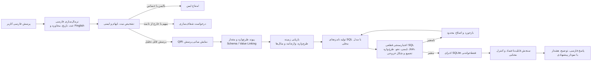

# معرفی دانشگاهی پروژه PARS-SQL / VTD-Edge

> **PARS-SQL** یک چارچوب پژوهشیِ فارسی‌محور، محلی و مبتنی بر قابلیت‌اعتماد برای تبدیل پرسش‌های زبان طبیعی به SQL است. این پروژه برای تحلیل تجمیعیِ داده‌های سلامت روان و سبک زندگی دانشجویان طراحی شده و هدف آن تولید صرفِ SQL نیست؛ بلکه تولید پاسخ‌های قابل ممیزی، ایمن، بازتولیدپذیر و آگاه از حریم خصوصی است.

## 1. شناسنامه پروژه

| مورد | توضیح |
|---|---|
| نام | **PARS-SQL**: Persian-Aware Reflexive Schema-grounded Text-to-SQL |
| نام مخزن | `ADHD-VTD` / `VTD-Edge` |
| حوزه | پردازش زبان طبیعی، مدل‌های زبانی محلی، Text-to-SQL، بازیابی اطلاعات، ایمنی داده و تحلیل سلامت روان |
| زبان ورودی | فارسی، شامل صورت‌های محاوره‌ای، غلط‌های رایج، اعداد فارسی و بخشی از Finglish |
| پایگاه‌داده هدف | SQLite پژوهشی، فقط با دسترسی خواندنی |
| کاربرد هدف | تحلیل‌های تجمیعی پژوهشی بر داده‌های سلامت روان و سبک زندگی دانشجویان |
| وضعیت کاربرد بالینی | **این سامانه ابزار تشخیص، درمان، تریاژ یا تصمیم‌گیری بالینی نیست.** |

## 2. مسئله‌ای که پروژه حل می‌کند

پرسش از داده‌های ساخت‌یافته معمولاً به دانستن SQL و شناخت دقیق جداول، ستون‌ها، روابط و تعریف شاخص‌ها نیاز دارد. این مانع برای پژوهشگران، کارشناسان و کاربران غیرفنی جدی است. تبدیل مستقیم پرسش طبیعی به SQL با یک مدل زبانی نیز قابل اعتماد نیست: مدل ممکن است جدول یا ستون خیالی بسازد، اتصال نادرست ایجاد کند، تجمیع را اشتباه بفهمد، یا حتی دستور مخرب تولید کند.

این مسئله در فارسی و در داده‌های حساس دشوارتر است، زیرا باید هم‌زمان با تنوع نوشتاری فارسی، ابهام مفهومی، نام‌های چندمعنایی شاخص‌های سلامت روان، و خطر افشای اطلاعات فردی برخورد شود.

بنابراین پرسش اصلی پروژه چنین است:

> چگونه می‌توان پرسش فارسی را به SQL معتبر و قابل‌اجرا تبدیل کرد، بدون آن‌که مدل زبانی مرجع ایمنی یا مرجع حقیقتِ طرح‌واره باشد، و در موارد مبهم یا حساس با امتناع یا درخواست شفاف‌سازی پاسخ داد؟

## 3. هدف‌ها و ارزش پژوهشی

هدف PARS-SQL ساخت یک خط لوله شبیه «کامپایلر» برای پرسش‌های فارسی است؛ خط لوله‌ای که پیش از اجرای SQL، معنا، طرح‌واره، محدودیت‌های ایمنی و شکل خروجی را بررسی می‌کند.

ارزش‌های اصلی پروژه عبارت‌اند از:

- **فارسی‌محوری:** نرمال‌سازی حروف، اعداد و تاریخ، نگاشت عبارت‌های محاوره‌ای و Finglish، و پیوند اصطلاحات فارسی به مفاهیم طرح‌واره.
- **قابلیت‌اعتماد قبل از پاسخ‌دهی:** SQL تولیدشده ورودی غیرقابل‌اعتماد تلقی می‌شود و فقط پس از اعتبارسنجی‌های قطعی اجرا می‌گردد.
- **حریم خصوصی و ایمنی:** اجرای محلی و فقط‌خواندنی، منع افشای رکوردهای فردی حساس، و امتناع از درخواست‌های مخرب یا خارج از دامنه.
- **قابلیت سنجش پژوهشی:** ثبت پیکربندی، ردپای اجرا، خروجی‌ها، هش‌ها و مانفیست هر آزمایش برای بازتولید و تحلیل خطا.
- **تفکیک درست معیارها:** درستی اجرای SQL، رفتار ایمنی/امتناع، و درستی معنایی/کسب‌وکاری با مخرج‌ها و معیارهای جدا گزارش می‌شوند.

## 4. معماری کلان

### جریان اجرایی

1. پرسش فارسی پاک‌سازی و استاندارد می‌شود.
2. سامانه تشخیص می‌دهد که آیا باید SQL تولید شود یا خیر؛ درخواست ناایمن رد و درخواست مبهم شفاف‌سازی می‌شود.
3. پرسش به یک نمایش میانی ساخت‌یافته (QIR) تبدیل می‌شود: شاخص، نوع تجمیع، فیلتر، بُعد گروه‌بندی و شکل خروجی.
4. تنها جدول‌ها، ستون‌ها، مسیرهای اتصال و مقدارهای مرتبط از طرح‌واره بازیابی می‌شوند.
5. مدل زبانی محلی SQL یا چند نامزد SQL تولید می‌کند.
6. یک پشته قطعیِ اعتبارسنجی، SQL را از نظر مجازبودن، نحو، وجود جدول/ستون، مسیر اتصال، تجمیع، و شکل تحلیلی کنترل می‌کند.
7. فقط SQL تأییدشده توسط اجراکننده فقط‌خواندنی اجرا می‌شود؛ خطاهای محدود می‌توانند وارد چرخه اصلاح شوند.
8. پاسخ نهایی همراه با نتیجه، توضیح و در صورت نیاز هشدار، درخواست شفاف‌سازی یا امتناع ارائه می‌شود.

## 5. اجزای اصلی پیاده‌سازی

| لایه | مسئولیت |
|---|---|
| `src/nlu/` | نرمال‌سازی فارسی، اعداد و تاریخ، تشخیص نیت، ابهام، اصطلاحات محاوره‌ای و درخواست‌های ناایمن |
| `src/schema/` | بارگذاری طرح‌واره، گراف روابط، پیوند مفاهیم و ستون‌ها، و پیوند مقدارها |
| `src/retrieval/` | بازیابی BM25، برداری و هیبریدی از طرح‌واره، واژه‌نامه و مثال‌ها |
| `src/generation/` | ساخت پرامپت، فراخوانی مدل محلی، تولید و تحلیل خروجی SQL |
| `src/sql_validation/` | اعتبارسنجی ایمنی، نحو، طرح‌واره، اتصال‌ها، تجمیع، معنا و شکل خروجی |
| `src/db/` | اتصال SQLite فقط‌خواندنی، محدودسازی تعداد سطرها و هش‌کردن نتیجه |
| `src/graph/` | ارکستراسیون حالت‌مند LangGraph، مسیریابی، تلاش مجدد، اصلاح و دروازه قابلیت‌اعتماد |
| `src/evaluation/` | اجرای بنچمارک، معیارها، تحلیل خطا، ابلیشن، قضاوت معنایی و بررسی سازگاری آثار آزمایش |
| `src/output/` | قالب‌بندی پاسخ فارسی، توضیح‌پذیری، داستان‌پردازی داده و پیشنهاد نمودار |

## 6. نوآوری‌ها و تمایزهای پیشنهادی

این پروژه صرفاً یک اتصال LLM به پایگاه‌داده یا یک RAG chatbot نیست. تمایزهای اصلی آن عبارت‌اند از:

1. **تولید SQL مبتنی بر طرح‌واره و QIR:** مدل مستقیماً از متن به SQL جهش نمی‌کند؛ ابتدا یک طرح پرسش ساخت‌یافته و قابل کنترل شکل می‌گیرد.
2. **کنترل قطعی پیرامون مدل زبانی:** مدل تنها نامزد SQL می‌سازد؛ اجازه اجرا و ایمنی را اعتبارسنج‌های قطعی تعیین می‌کنند.
3. **گراف طرح‌واره و پیوند مقدار:** روابط مجاز بین حوزه‌ها از گراف طرح‌واره گرفته می‌شود تا اتصال‌های مصنوعی و نادرست کاهش یابد.
4. **پشتیبانی ویژه از فارسی:** نرمال‌سازی، اعداد، تاریخ، محاوره، غلط نوشتاری و Finglish بخشی از هسته سامانه‌اند، نه قابلیت جانبی رابط کاربری.
5. **خوداصلاحی محدود و قابل ممیزی:** اصلاح SQL پس از بازخورد ساخت‌یافته انجام می‌شود و برای خطاهای تکراری، مسیرهای کنترل‌شده دارد.
6. **ارزیابی رفتاری فراتر از EX:** امتناع ایمن، درخواست شفاف‌سازی، تشخیص خروج از دامنه و پرهیز از SQL نیز جداگانه سنجیده می‌شوند.
7. **بازآفرینی‌پذیری مبتنی بر اثر آزمایش:** هر ادعای نتیجه‌محور باید به پیکربندی، پیش‌بینی‌ها، خلاصه، مانفیست و هش قابل ردیابی باشد.

## 7. ایمنی، حریم خصوصی و اخلاق

پروژه در دامنه حساس سلامت روان قرار دارد؛ به همین دلیل، ایمنی یک افزونه نیست، بلکه محدودیت معماری است.

- فقط `SELECT` و `WITH ... SELECT` مجازند؛ عملیات نوشتن یا تغییر ساختار پایگاه‌داده ممنوع است.
- SQL فقط از مسیر اجراکننده فقط‌خواندنی اجرا می‌شود.
- درخواست رکوردهای فردی حساس یا دارای شناسه‌های شخصی باید رد یا به تحلیل تجمیعی هدایت شود.
- نام، شناسه، ایمیل، شماره تماس و خروجی ردیفیِ حساس نباید در پاسخ نهایی افشا شوند.
- اتصال بین حوزه‌های داده تنها وقتی پذیرفته می‌شود که در گراف طرح‌واره مجاز تعریف شده باشد.
- اجرای محلی/خصوصی اولویت دارد؛ استفاده از سرویس ابری فقط برای داده مصنوعی یا ناشناس‌سازی‌شده و آزمایش‌های مقایسه‌ای در نظر گرفته می‌شود.

## 8. داده و روش ارزیابی

بسته داده پژوهشی فعلی **VTD Health Intelligent Dashboard Persian NL2SQL Dataset** است. این بسته برای ارزیابی پژوهشی ساخته شده و داده بالینی واقعی یا ابزار تصمیم‌یار پزشکی نیست.

| بخش | تعداد | کاربرد |
|---|---:|---|
| `positive400` | 400 نمونه | سنجش پرسش‌های فارسی که باید به SQL تبدیل شوند |
| `behavioral100` | 100 نمونه | سنجش رفتار در ابهام، ناایمنی، خارج از دامنه، پاسخ بدون SQL، خطای تایپی/Finglish و توصیه نمودار |
| کل بسته | 500 نمونه | نمای کلی داده پژوهشی |

معیارها عمداً از هم جدا نگه داشته می‌شوند:

| خانواده معیار | معنای آن |
|---|---|
| اجرای دقیق SQL (Execution Accuracy / EX) | مقایسه نتیجه اجرای SQL تولیدشده با SQL مرجع برای نمونه‌های SQL-مثبت |
| نرخ SQL معتبر | سهم SQLهایی که اعتبارسنجی و اجرای لازم را می‌گذرانند |
| دقت اقدام مورد انتظار | انتخاب صحیح پاسخ، شفاف‌سازی، امتناع یا تولید SQL در نمونه‌های رفتاری |
| معیارهای امتناع | دقت و بازیابی امتناع برای درخواست‌های ناایمن یا نامناسب |
| درستی معنایی/کسب‌وکاری | سنجش جداگانه این‌که SQL/پاسخ واقعاً به نیت کاربر و منطق پرسش وفادار است |

## 9. وضعیت شواهد کنونی

نتایج زیر از آثار ثبت‌شده پروژه استخراج شده‌اند و برای جلوگیری از برداشت نادرست، هرکدام با دامنه خود گزارش می‌شوند.

| مورد | نتیجه ثبت‌شده | تفسیر درست |
|---|---:|---|
| اجرای SQLهای مرجع `positive400` | `400/400` موفق | کیفیت و قابلیت اجرای SQLهای طلایی را تأیید می‌کند؛ عملکرد عامل تولیدکننده SQL نیست. |
| اجرای عامل محلیِ بدون قالب قطعی روی `positive400` | `102/394 = 25.89%` EX | خط مبنای اصلی محلی/خصوصی است؛ عملکرد مطلق هنوز پایین است. |
| SQL معتبر در همان اجرای عامل | `295/394 = 74.87%` | معتبر بودن نحوی/ساختاری به‌تنهایی معادل درست بودن نتیجه نیست. |
| رفتار `behavioral100` | `76/100 = 76%` دقت اقدام مورد انتظار | رفتار ایمنی و هدایت مکالمه را می‌سنجد، نه EX نمونه‌های SQL-مثبت. |
| رد درخواست ناایمن در `behavioral100` | `16/16 = 100%` | شاهد رفتاری برای رد درخواست‌های ناایمن در همان مجموعه است. |
| ارزیابی معنایی 400 نمونه | `161/400 = 40.25%` درستی کسب‌وکاری | قضاوت مدل‌محورِ دارای اثر ثبت‌شده است، نه جایگزین بازبینی انسانی. |

**جمع‌بندی صادقانه وضعیت:** سامانه از نظر معماری، ایمنی و بازتولیدپذیری پایه‌های عملی محکمی دارد، اما دقت اجرای SQL محلی و درستی معنایی هنوز برای ادعای عملکرد بالا کافی نیست. ارزش پژوهشی پروژه در قابل‌سنجش کردن این فاصله، تحلیل خطا و بهبود مرحله‌ای آن است.

## 10. فناوری‌ها و ابزارهای اصلی

| حوزه | فناوری‌ها |
|---|---|
| زبان و قراردادهای داده | Python 3.12، Type Hints، Dataclasses، Pydantic |
| ارکستراسیون عامل | LangGraph و checkpoint مبتنی بر SQLite |
| مدل زبانی محلی | `llama-cpp-python` و مدل‌های محلی کمّی‌شده؛ در اجراهای ثبت‌شده Qwen2.5-Coder-7B-Instruct GGUF |
| پایگاه‌داده | SQLite در حالت فقط‌خواندنی |
| تحلیل و ایمنی SQL | `sqlglot` و اعتبارسنج‌های اختصاصی ایمنی، طرح‌واره، Join، تجمیع و shape |
| بازیابی | BM25، ChromaDB، Sentence Transformers، PyTorch و reranking قابل پیکربندی |
| پردازش فارسی | Hazm، persiantools، RapidFuzz و regex |
| گراف و پیوند طرح‌واره | NetworkX و فایل‌های JSON برای snapshot، واژه‌نامه، نام‌های مستعار و گراف طرح‌واره |
| تحلیل داده و آمار | NumPy، pandas، SciPy، scikit-learn، statsmodels، matplotlib و seaborn |
| آزمون و کیفیت کد | pytest، Ruff، Black، isort و mypy |
| پیکربندی و آثار آزمایش | YAML، JSON/JSONL، manifest، hash و گزارش‌های قابل بررسی |

## 11. بازتولیدپذیری و کیفیت مهندسی

پروژه برای کار پژوهشی صرفاً به یک عدد نهایی متکی نیست. هر اجرای قابل گزارش باید شامل پیکربندی ثابت، پیش‌بینی‌ها، خلاصه معیارها، ردپای تلاش‌ها، مانفیست و هش باشد. علاوه بر آزمون‌های واحد و یکپارچه، بررسی سازگاری اثر آزمایش و دروازه آمادگی انتشار برای جلوگیری از استناد به اجرای آزمایشی، ناقص یا غیرقابل‌تکرار وجود دارد.

ساختار آزمایش‌ها سه سطح دارد:

- آزمون‌های واحد برای NLU، اعتبارسنجی SQL، پیوند طرح‌واره، اجراکننده فقط‌خواندنی و قراردادهای خروجی.
- آزمون‌های یکپارچه برای گردش کار LangGraph و چرخه اصلاح.
- آزمون‌های اثر/بنچمارک برای مانفیست‌ها، نتایج، ابلیشن و قابلیت بازتولید.

## 12. محدودیت‌ها و ریسک‌های علمی

برای معرفی علمی درست، محدودیت‌های زیر باید صریحاً بیان شوند:

- پروژه یک سامانه بالینی، تشخیصی یا تصمیم‌یار درمانی نیست.
- دقت EX عامل محلی فعلی پایین است و نباید با عبارت‌هایی مانند «دقت بالا» یا «بهترین عملکرد» توصیف شود.
- ارزیابی درستی معنایی فعلی مدل‌محور است و برای ادعای قوی‌تر به نمونه‌برداری و بازبینی انسانی نیاز دارد.
- پوشش فارسی محاوره‌ای، Finglish، خطاهای تایپی و تاریخ جلالی مفید اما کامل نیست.
- داده‌ها عمدتاً برای پژوهش طراحی و توسط یک پدیدآورنده تهیه شده‌اند؛ بازبینی مستقل و مجموعه آزمون بازنویسی‌شده می‌تواند خطر بیش‌برازش را کاهش دهد.
- reranker فعلی در برخی آزمایش‌ها نقش سیم‌کشی/identity دارد و نباید به‌عنوان ادعای مزیت یک reranker مدل‌محور گزارش شود.

## 13. مسیر ادامه پژوهش

اولویت‌های منطقی ادامه کار عبارت‌اند از:

1. بهبود قراردادهای شکل پرسش و پرامپت‌های وابسته به مسیر.
2. تقویت grounding مقدارها و ارزیابی مستقل schema/value linking.
3. مقایسه کنترل‌شده نامزدهای متعدد با بودجه تأخیر مشخص.
4. تولید مجموعه holdout بازنویسی‌شده و بازبینی انسانی نمونه‌ای از قضاوت‌های معنایی.
5. تحلیل خطا بر حسب نوع پرسش، تجمیع، اتصال، مقدار و ابهام.
6. پس از تثبیت خط لوله پژوهشی، ساده‌سازی آن برای اجرای سبک‌تر در لبه یا دستگاه محلی.

## 14. متن کوتاه پیشنهادی برای ارائه شفاهی

«PARS-SQL یک سامانه پژوهشی فارسی برای تبدیل پرسش‌های طبیعی به SQL در تحلیل‌های تجمیعی سلامت روان و سبک زندگی دانشجویان است. تفاوت آن با اتصال مستقیم یک مدل زبانی به دیتابیس در این است که SQL را یک خروجی غیرقابل‌اعتماد می‌داند: ابتدا پرسش فارسی را نرمال می‌کند، ابهام و ایمنی را می‌سنجد، آن را به یک طرح ساخت‌یافته تبدیل می‌کند، فقط بخش‌های مرتبط طرح‌واره را بازیابی می‌کند و سپس SQL تولیدشده را از چندین اعتبارسنج قطعی عبور می‌دهد. اجرا نیز فقط‌خواندنی و محدود است. پروژه علاوه بر دقت SQL، رفتار امتناع، درخواست شفاف‌سازی، حریم خصوصی و بازتولیدپذیری آزمایش‌ها را اندازه می‌گیرد. در وضعیت فعلی، معماری و زیرساخت ارزیابی پیاده‌سازی شده‌اند، اما بهبود دقت عامل محلی و اعتبارسنجی انسانی نتایج معنایی همچنان مسئله اصلی پژوهش هستند.»

## 15. منابع داخلی برای بررسی بیشتر

- معماری کامل: `docs/01_RESEARCH_GRADE_ARCHITECTURE.md`
- گردش کار LangGraph: `docs/02_LANGGRAPH_WORKFLOW_SPEC.md`
- NLU فارسی و schema linking: `docs/03_PERSIAN_NLU_AND_SCHEMA_LINKING.md`
- تولید، اعتبارسنجی و اصلاح SQL: `docs/05_SQL_GENERATION_VALIDATION_REFLEXION.md`
- داده و محدودیت‌ها: `docs/DATASET_CARD.md`
- نتایجِ مبتنی بر اثر آزمایش: `docs/PARS_SQL_PAPER1_RESULTS_SUMMARY.md`
- راهنمای بازتولید: `docs/PARS_SQL_PAPER1_REPRODUCIBILITY.md`

---

**تاریخ تهیه:** ۱۸ ژوئیه ۲۰۲۶  
**مخاطب:** استاد راهنما، داور دانشگاهی یا همکار پژوهشی  
**وضعیت سند:** معرفی دانشگاهیِ مبتنی بر وضعیت و مستندات فعلی مخزن
