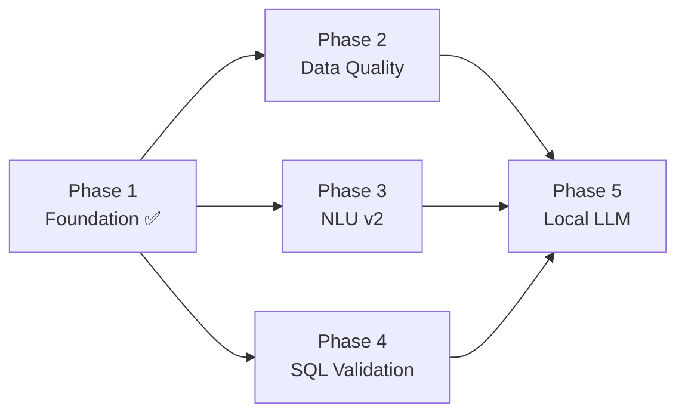

# Phase 1 — Fix Existing Foundation Gaps

## Completion Update - 2026-05-15

Phase 1 با وضعیت واقعی کد و تست‌ها reconcile شد و در `task.md` به `COMPLETED` تغییر کرد.

- `src/utils/jsonl.py` و `src/utils/hashing.py` پیاده‌سازی فعال دارند.
- `src/nlu/ambiguity_detector.py`، `date_normalizer.py`، `colloquial_mapper.py` و `safety_intent_detector.py` تست مستقیم دارند.
- `src/schema/value_linker.py` برای gender، risk و depression flag تست مستقیم دارد.
- `tests/tier1_unit/test_utils_jsonl_hashing.py` اضافه شد تا JSONL و hashing هم پوشش مستقیم داشته باشند.
- اجرای هدفمند Phase 1: `65 passed`.
- اجرای کامل Tier 1 پس از sync: `143 passed`.

Command:

```powershell
.\.venv\Scripts\python.exe -m pytest tests\tier1_unit\test_utils_jsonl_hashing.py tests\tier1_unit\test_ambiguity_detector.py tests\tier1_unit\test_date_normalizer.py tests\tier1_unit\test_colloquial_mapper.py tests\tier1_unit\test_safety_detector.py tests\tier1_unit\test_value_linker.py -q
```

> **وضعیت:** ✅ تکمیل‌شده  
> **تاریخ اجرا:** 2026-05-14  
> **نتیجه تست‌ها:** 118/118 passed (0.39s)  
> **فایل‌های تغییر‌یافته:** 20 فایل (10 پیاده‌سازی + 1 conftest + 11 تست)

---

## ۱. هدف این فاز

Phase 1 وظیفه پر کردن شکاف‌های بنیادی پروژه را داشت. پس از Phase 0 (schema freeze + audit)، چندین فایل اسکلتی (scaffold) بدون محتوا باقی مانده بودند. هدف:

1. **Exception Hierarchy** — سلسله‌مراتب خطاهای تخصصی برای هر لایه
2. **Utilities** — ابزارهای مشترک (logging, JSONL, hashing, timing)
3. **NLU Enhancements** — رفع نقص‌های شناسایی‌شده در NLU pipeline
4. **SQL Rewriter** — تکمیل قابلیت‌های بازنویسی SQL
5. **CLI Entry Point** — نقطه ورود واقعی بجای PyCharm default
6. **Unit Tests** — پوشش تست برای تمام ماژول‌های موجود

---

## ۲. فایل‌های تغییر‌یافته

| فایل | نوع تغییر | خطوط کد |
|---|---|---|
| `src/core/exceptions.py` | 🟡→✅ پیاده‌سازی | 79 |
| `src/utils/logging.py` | 🟡→✅ پیاده‌سازی | 84 |
| `src/utils/jsonl.py` | 🟡→✅ پیاده‌سازی | 73 |
| `src/utils/hashing.py` | 🟡→✅ پیاده‌سازی | 47 |
| `src/utils/timing.py` | 🟡→✅ پیاده‌سازی | 101 |
| `src/nlu/term_extractor.py` | 🟡→✅ پیاده‌سازی | 118 |
| `src/nlu/ambiguity_detector.py` | ✅→✅ بهبود | 120 |
| `src/nlu/intent_classifier.py` | ✅→✅ بهبود | 126 |
| `src/sql_validation/sql_rewriter.py` | ✅→✅ بهبود | 88 |
| `main.py` | 🟡→✅ پیاده‌سازی | 132 |
| `pyproject.toml` | 🐛 رفع باگ | — |
| `tests/tier1_unit/conftest.py` | ❌→✅ جدید | 38 |
| `tests/tier1_unit/test_persian_normalizer.py` | ❌→✅ جدید | 15 tests |
| `tests/tier1_unit/test_number_normalizer.py` | ❌→✅ جدید | 12 tests |
| `tests/tier1_unit/test_date_normalizer.py` | ❌→✅ جدید | 7 tests |
| `tests/tier1_unit/test_colloquial_mapper.py` | ❌→✅ جدید | 9 tests |
| `tests/tier1_unit/test_safety_detector.py` | ❌→✅ جدید | 14 tests |
| `tests/tier1_unit/test_ambiguity_detector.py` | ❌→✅ جدید | 10 tests |
| `tests/tier1_unit/test_schema_linker.py` | ❌→✅ جدید | 6 tests |
| `tests/tier1_unit/test_value_linker.py` | ❌→✅ جدید | 5 tests |
| `tests/tier1_unit/test_safety_validator.py` | ❌→✅ جدید | 8 tests |
| `tests/tier1_unit/test_schema_validator.py` | ❌→✅ جدید | 4 tests |
| `tests/tier1_unit/test_read_only_executor.py` | ❌→✅ جدید | 4 tests |

---

## ۳. جزئیات هر کامپوننت

### ۳.۱. Exception Hierarchy — `src/core/exceptions.py`

#### مشکل قبلی
فایل کاملاً خالی بود. هیچ exception تخصصی تعریف نشده بود و ماژول‌ها از `Exception` عمومی استفاده می‌کردند.

#### طراحی
```
VTDException (base)
├── SchemaNotFoundError
│   ├── SchemaColumnNotFoundError
│   └── SchemaTableNotFoundError
├── UnsafeSQLError
├── SQLValidationError
├── SQLExecutionError
├── AmbiguousQueryError
├── UnsupportedQueryError
├── GenerationError
│   └── OutputParseError
├── RetrievalError
├── ConfigurationError
├── ReliabilityGateError
└── DatasetError
```

#### ویژگی‌های طراحی
- **`details: dict`** — هر exception یک دیکشنری metadata حمل می‌کند
- **وراثت سلسله‌مراتبی** — `SchemaColumnNotFoundError` از `SchemaNotFoundError` ارث می‌برد
- **catch-all** — با `except VTDException` کل خانواده قابل catch است

#### نحوه استفاده
```python
from src.core.exceptions import SchemaNotFoundError, UnsafeSQLError

# Raising with details
raise SchemaNotFoundError(
    "Column 'fake_col' not found in 'student_depression'",
    details={"table": "student_depression", "column": "fake_col"}
)

# Catching family
try:
    validate_sql(sql)
except VTDException as e:
    logger.error(f"VTD error: {e}", extra=e.details)
```

---

### ۳.۲. Structured Logger — `src/utils/logging.py`

#### مشکل قبلی
فایل خالی. هیچ سیستم logging در پروژه وجود نداشت.

#### طراحی
- **Engine:** `loguru` (نصب‌شده در requirements.txt)
- **Trace ID:** از `contextvars` برای ردیابی درخواست‌ها در async/thread context
- **Console Output:** Rich-formatted با رنگ و trace_id
- **File Output:** فایل‌های log با rotation (10MB) و retention (30 روز)

#### API Reference

| تابع | شرح |
|---|---|
| `new_trace_id() → str` | تولید trace_id جدید (12 کاراکتر hex) و set در context |
| `get_trace_id() → str` | بازگرداندن trace_id فعلی |
| `set_trace_id(id)` | تنظیم دستی trace_id |
| `get_logger(name) → Logger` | دریافت logger با نام ماژول |
| `vtd_logger` | logger آماده برای import مستقیم |

#### تنظیمات محیطی

| متغیر | مقدار پیش‌فرض | شرح |
|---|---|---|
| `VTD_LOG_LEVEL` | `INFO` | سطح log برای console |
| `VTD_LOG_DIR` | `logs/` | مسیر ذخیره فایل‌های log |

#### نحوه استفاده
```python
from src.utils.logging import vtd_logger, new_trace_id

trace = new_trace_id()
vtd_logger.info(f"Processing question: {question}")
vtd_logger.debug(f"Schema link result: {result}")
```

#### خروجی نمونه Console
```
17:24:15 | INFO     | a3b2c4d5e6f7 | Processing question: میانگین نمره افسردگی
```

#### خروجی نمونه File
```
2026-05-14T17:24:15.123 | INFO | a3b2c4d5e6f7 | Processing question: میانگین نمره افسردگی
```

---

### ۳.۳. JSONL Helpers — `src/utils/jsonl.py`

#### مشکل قبلی
فایل خالی. اما JSONL فرمت اصلی benchmark predictions، golden examples، و audit logs است.

#### API Reference

| تابع | شرح |
|---|---|
| `read_jsonl(path) → list[dict]` | خواندن کامل فایل JSONL |
| `iter_jsonl(path) → Iterator[dict]` | خواندن lazy (حافظه‌بهینه) |
| `write_jsonl(path, records) → int` | نوشتن (overwrite) — return count |
| `append_jsonl(path, record)` | اضافه کردن یک رکورد |
| `append_jsonl_batch(path, records) → int` | اضافه کردن چندین رکورد |

#### ویژگی‌ها
- **خودکار parent directory** — اگر مسیر وجود نداشته باشد می‌سازد
- **encoding UTF-8** — پشتیبانی کامل فارسی
- **گزارش خطا** — شماره خط خطا در parse error
- **ensure_ascii=False** — فارسی به شکل خوانا ذخیره می‌شود

#### نحوه استفاده
```python
from src.utils.jsonl import read_jsonl, append_jsonl, write_jsonl

# Read
records = read_jsonl("data/golden_sql/golden_examples.jsonl")

# Write
write_jsonl("results/predictions.jsonl", predictions)

# Append single record
append_jsonl("results/attempts.jsonl", {
    "case_id": "q001",
    "sql": "SELECT ...",
    "status": "pass"
})
```

---

### ۳.۴. Hashing Utilities — `src/utils/hashing.py`

#### مشکل قبلی
فایل خالی. `result_serializer.py` در ماژول `db` hashing انجام می‌داد اما utility عمومی وجود نداشت.

#### API Reference

| تابع | شرح |
|---|---|
| `sql_hash(sql) → str` | SHA-256 hash پس از نرمال‌سازی whitespace و lowercase |
| `result_hash(rows) → str` | SHA-256 hash قطعی از ردیف‌های نتیجه query |
| `text_hash(text) → str` | SHA-256 hash ساده برای محتوای متنی |

#### کاربردها
- **`sql_hash`** — تشخیص SQL تکراری در retry loop (transition_memory)
- **`result_hash`** — مقایسه نتایج generated vs gold SQL (EX metric)
- **`text_hash`** — hashing محتوای عمومی

#### نحوه استفاده
```python
from src.utils.hashing import sql_hash, result_hash

# Detect duplicate SQL across retries
h1 = sql_hash("SELECT COUNT(*) FROM student_depression")
h2 = sql_hash("select  count(*)  from  student_depression ;")
assert h1 == h2  # Identical after normalization

# Compare query results
match = result_hash(generated_rows) == result_hash(gold_rows)
```

---

### ۳.۵. Timing Utilities — `src/utils/timing.py`

#### مشکل قبلی
فایل خالی. هیچ ابزار اندازه‌گیری latency وجود نداشت.

#### API Reference

| ابزار | نوع | شرح |
|---|---|---|
| `measure_latency(stage)` | context manager | اندازه‌گیری زمان یک بلاک کد |
| `@timed(stage)` | decorator | اندازه‌گیری زمان یک تابع |
| `StageTimer` | class | جمع‌آوری زمان چندین مرحله |
| `TimingRecord` | dataclass | نتیجه یک اندازه‌گیری |

#### نحوه استفاده
```python
from src.utils.timing import measure_latency, StageTimer

# Single measurement
with measure_latency("schema_linking") as t:
    result = schema_linker.link(question)
print(f"Schema linking: {t.elapsed_ms:.1f}ms")

# Multi-stage pipeline
timer = StageTimer()
with timer.measure("normalize"):
    normalized = normalizer.normalize(text)
with timer.measure("intent"):
    intent = classifier.classify(normalized)
with timer.measure("link"):
    linked = linker.link(normalized)

print(timer.summary_str())
# Output:
#   normalize: 0.3ms
#   intent: 0.2ms
#   link: 1.5ms
#   TOTAL: 2.0ms
```

---

### ۳.۶. Term Extractor — `src/nlu/term_extractor.py`

#### مشکل قبلی
فایل کاملاً خالی. Schema linker بدون term extraction مستقیماً از substring match استفاده می‌کرد.

#### طراحی
- **Stopwords:** ۵۵ فارسی + ۳۰ انگلیسی
- **Tokenization:** regex-based (`[\w\u0600-\u06FF]+`)
- **N-grams:** unigram, bigram, trigram
- **اولویت:** n-gram بلندتر اول (ترکیبات پزشکی مثل «ریسک بالا»)

#### API Reference

| متد | شرح |
|---|---|
| `extract(text) → TermExtractionResult` | استخراج کامل با normalized, terms, bigrams, trigrams, numbers |
| `extract_terms(text) → list[str]` | فقط لیست terms |
| `extract_all_ngrams(text) → list[str]` | trigrams + bigrams + terms ترکیب‌شده |

#### مثال
```python
from src.nlu.term_extractor import TermExtractor

extractor = TermExtractor()
result = extractor.extract("میانگین نمره افسردگی دانشجوهای زن")

print(result.terms)    # ['میانگین', 'نمره', 'افسردگی', 'دانشجوهای', 'زن']
print(result.bigrams)  # ['میانگین نمره', 'نمره افسردگی', 'افسردگی دانشجوهای', 'دانشجوهای زن']
print(result.trigrams) # ['میانگین نمره افسردگی', 'نمره افسردگی دانشجوهای', 'افسردگی دانشجوهای زن']
```

---

### ۳.۷. Ambiguity Detector — `src/nlu/ambiguity_detector.py` (بهبود)

#### مشکلات قبلی
1. تشخیص «بهترین/بدترین بدون metric» نداشت
2. تشخیص «نمودار بدون measure/dimension» نداشت
3. threshold کم برای short requests

#### تغییرات

| قابلیت جدید | الگوهای اضافه‌شده |
|---|---|
| **Ranking بدون metric** | بهترین، بدترین، بیشترین، کمترین، بالاترین، top, best, worst, highest, lowest |
| **Chart بدون measure** | نمودار، چارت، chart, graph, plot, histogram و انواع نمودار فارسی |
| **Dimension hints** | بر اساس، تفکیک، جنسیت، سال، کشور، gender, year, country |
| **Metric hints گسترش‌یافته** | phq9, gad7, bdi, sleep, score, gpa, depression, anxiety اضافه شد |

#### منطق امتیازدهی

| بررسی | امتیاز | توضیح |
|---|---|---|
| Generic pattern match | +0.6 | «آمار کلی»، «خلاصه بده» و ... |
| Ranking بدون metric | +0.5 | «بهترین» بدون مشخص کردن شاخص |
| Top-N بدون metric | +0.4 | «top 10» بدون metric |
| Chart بدون هر دو | +0.5 | نمودار بدون measure و dimension |
| Chart بدون measure | +0.3 | نمودار با dimension اما بدون measure |
| Short request (≤3 words) | +0.5 | درخواست کوتاه بدون metric |
| **آستانه ابهام** | **≥0.5** | اگر مجموع ≥0.5 → ابهام |

#### Clarification Questions
سوالات clarification بر اساس نوع ابهام تولید می‌شوند:
- **Ranking:** «بر اساس چه شاخصی رتبه‌بندی؟»
- **Chart:** «چه شاخصی و بر اساس چه بعدی نمودار؟»
- **Generic:** «کدام شاخص یا دیتاست؟»

---

### ۳.۸. Intent Classifier — `src/nlu/intent_classifier.py` (بهبود)

#### مشکلات قبلی
فاقد سه intent مهم: `comparison_query`، `definition_query`، `raw_retrieval_query`

#### Intent‌های جدید

| Intent | trigger | should_generate_sql | expected_action |
|---|---|---|---|
| `definition_query` | چیست، تعریف، what is | ❌ `False` | `answer_without_sql` |
| `comparison_query` | مقایسه، تفاوت، compare, vs | ✅ `True` | `generate_sql` |
| `raw_retrieval_query` | لیست، فهرست، show all | ✅ `True` | `generate_sql` |
| `chart_query` | نمودار، chart, graph | ✅ `True` | `generate_sql` |

#### ترتیب اولویت classification
```
1. Safety Gate      → unsafe → refuse
2. Ambiguity Gate   → ambiguous → ask_clarification
3. Definition       → definition_query → answer_without_sql
4. Comparison       → comparison_query → generate_sql
5. Raw Retrieval    → raw_retrieval_query → generate_sql
6. Chart            → chart_query → generate_sql
7. Dashboard        → dashboard_or_storytelling → generate_sql
8. Time Series      → time_series_query → generate_sql
9. Rate             → rate_query → generate_sql
10. Aggregation     → aggregation_query → generate_sql
11. Count           → count_query → generate_sql
12. Grouping        → grouping_query → generate_sql
13. Ranking         → ranking_query → generate_sql
14. Default         → general_sql_query → generate_sql
```

#### مثال
```python
from src.nlu.intent_classifier import IntentClassifier

clf = IntentClassifier()

# Definition → no SQL
result = clf.classify("افسردگی چیست?")
# intent="definition_query", should_generate_sql=False

# Comparison → SQL
result = clf.classify("مقایسه افسردگی بین زن و مرد")
# intent="comparison_query", should_generate_sql=True

# Raw retrieval → SQL with LIMIT note
result = clf.classify("لیست همه دانشجوهای افسرده")
# intent="raw_retrieval_query", should_generate_sql=True
```

---

### ۳.۹. SQL Rewriter — `src/sql_validation/sql_rewriter.py` (بهبود)

#### مشکلات قبلی
- حذف markdown fences نداشت (LLM ها اغلب SQL را در ` ```sql ``` ` می‌پیچند)
- اصلاح نام ستون `gpa` → `cgpa` نداشت

#### قابلیت‌های جدید

| متد | شرح |
|---|---|
| `strip_markdown_fences(sql)` | حذف ` ```sql ... ``` ` و `` ` `` inline |
| `fix_column_names(sql)` | اصلاح `gpa` → `cgpa` (بدون تأثیر روی `cgpa` موجود) |
| `rewrite(sql, add_limit, limit)` | زنجیره کامل همه تبدیل‌ها |

#### ترتیب اعمال rewrite
```
1. Strip markdown fences
2. Strip trailing semicolons
3. Fix column name typos
4. Add LIMIT if needed (skip if GROUP BY or aggregate)
5. Normalize whitespace
```

#### مثال
```python
from src.sql_validation.sql_rewriter import SQLRewriter

rw = SQLRewriter()

# Full chain
result = rw.rewrite("```sql\nSELECT * FROM student_depression WHERE gpa > 3;\n```")
# → "SELECT * FROM student_depression WHERE cgpa > 3 LIMIT 100"

# Individual methods
rw.strip_markdown_fences("```sql\nSELECT 1\n```")  # → "SELECT 1"
rw.fix_column_names("SELECT gpa FROM t")            # → "SELECT cgpa FROM t"
```

---

### ۳.۱۰. CLI Entry Point — `main.py`

#### مشکل قبلی
فایل PyCharm default (`print_hi('PyCharm')`) — هیچ عملکرد واقعی نداشت.

#### دستورات CLI

| دستور | شرح | مثال |
|---|---|---|
| `normalize` | نرمال‌سازی فارسی | `python main.py normalize "دیپرشن student ha"` |
| `classify` | تشخیص intent | `python main.py classify "تعداد افسرده ها"` |
| `link` | schema linking | `python main.py link "میانگین نمره افسردگی زنان"` |
| `validate` | اعتبارسنجی SQL | `python main.py validate "SELECT COUNT(*) FROM t"` |
| `extract-terms` | استخراج terms | `python main.py extract-terms "نمره اضطراب"` |
| `smoke-test` | تست سریع همه اجزا | `python main.py smoke-test` |
| `info` | نمایش تنظیمات | `python main.py info` |

#### وابستگی‌ها
- `typer` — CLI framework
- `rich` — Pretty console output (Table, colored text)

---

### ۳.۱۱. Bug Fix — `pyproject.toml` BOM

#### مشکل
فایل `pyproject.toml` دارای UTF-8 BOM (`\xef\xbb\xbf`) بود. TOML parser در pytest 9.x از BOM پشتیبانی نمی‌کند و با خطای `Invalid statement (at line 1, column 1)` fail می‌شد.

#### رفع
BOM bytes از ابتدای فایل حذف شدند. دقت شود در ویرایش‌های بعدی از editor هایی که BOM اضافه می‌کنند استفاده نشود.

---

## ۴. Unit Tests

### ساختار تست‌ها
```
tests/tier1_unit/
├── conftest.py                    # Shared fixtures
├── test_persian_normalizer.py     # 15 tests — chars, digits, ZWNJ, typos, colloquial
├── test_number_normalizer.py      # 12 tests — digits, word→number, extraction
├── test_date_normalizer.py        #  7 tests — Jalali, vague temporal, non-temporal
├── test_colloquial_mapper.py      #  9 tests — depression, anxiety, student, CGPA
├── test_safety_detector.py        # 14 tests — forbidden SQL, injection, safe queries
├── test_ambiguity_detector.py     # 10 tests — generic, ranking, chart, short
├── test_schema_linker.py          #  6 tests — depression, gender, CGPA, confidence
├── test_value_linker.py           #  5 tests — gender, risk, depression flag
├── test_safety_validator.py       #  8 tests — reject unsafe, accept safe, SELECT*
├── test_schema_validator.py       #  4 tests — fake columns, unknown tables, old tables
└── test_read_only_executor.py     #  4 tests — safety gate, mock DB, gold SQL
```

### اجرای تست‌ها
```powershell
& .venv\Scripts\python.exe -m pytest tests\tier1_unit\ -v --tb=short
```

### نتیجه
```
118 passed in 0.39s
```

---

## ۵. پیشنهادات بهبود

### اولویت بالا (Phase 2–3)
| پیشنهاد | فایل | فاز |
|---|---|---|
| استفاده از `IntentLabel` enum بجای string literals | `intent_classifier.py` | Phase 3 |
| استفاده از `hazm` tokenizer بجای regex | `term_extractor.py` | Phase 3 |
| اضافه کردن `error_code` به `VTDException` | `exceptions.py` | Phase 2 |

### اولویت متوسط (Phase 4–6)
| پیشنهاد | فایل | فاز |
|---|---|---|
| JSON-structured file logging (`serialize=True`) | `logging.py` | Phase 2 |
| AST-based SQL rewriting با sqlglot | `sql_rewriter.py` | Phase 4 |
| Multi-label intent support | `intent_classifier.py` | Phase 5 |
| Confidence calibration با labeled data | `intent_classifier.py` | Phase 6 |

### اولویت پایین (Phase 10+)
| پیشنهاد | فایل | فاز |
|---|---|---|
| Prometheus metrics export | `logging.py` | Phase 10 |
| Log redaction برای sensitive data | `logging.py` | Phase 15 |
| StageTimer ← vtd_logger integration | `timing.py` | Phase 10 |

---

## ۶. وابستگی به فازهای بعدی



- **Phase 2** از `jsonl.py` برای convert/validate dataset استفاده خواهد کرد
- **Phase 3** از `term_extractor.py` برای input به `query_planner.py` استفاده خواهد کرد
- **Phase 4** از `exceptions.py` برای error handling در validators استفاده خواهد کرد
- **Phase 5** از `logging.py` و `timing.py` برای pipeline profiling استفاده خواهد کرد
